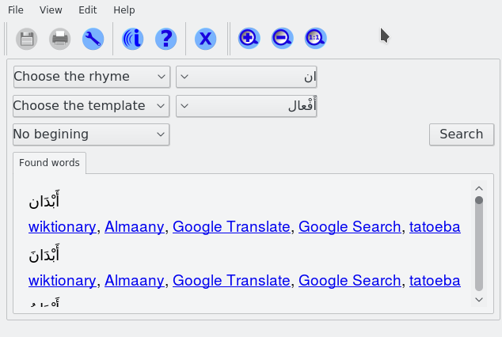

# Assajjaa

In Arabic (السّجّاع) which means the one who generates the rhyme.
This is a project to help poets to search and find words in Arabic language.

## Features

* Using the beginning and ending of words for search
* Using pattern for search (In Arabic, each word can have a pattern)
* Links to other websites

## Install

Just check [release](https://github.com/kariminf/assajjaa/releases/latest) section.
Currently, Windows is the only system that has release.
For Linux,
* install Qt
* Download the source
* Download [arwords.db.tar.gz]() from release section
* Extract it in "Assajjaa/Media/DB/"
* Open the project using Qt creator and compile

## License

Copyright (C) 2016  Abdelkrime Aries and Hisham Omar

This program is free software: you can redistribute it and/or modify
it under the terms of the GNU General Public License as published by
the Free Software Foundation, either version 3 of the License, or
(at your option) any later version.

This program is distributed in the hope that it will be useful,
but WITHOUT ANY WARRANTY; without even the implied warranty of
MERCHANTABILITY or FITNESS FOR A PARTICULAR PURPOSE.  See the
GNU General Public License for more details.

You should have received a copy of the GNU General Public License
along with this program.  If not, see <http://www.gnu.org/licenses/>.
